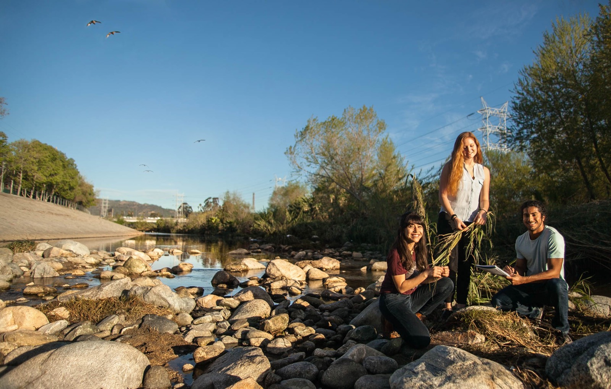

# IoES Student Handbook Version 2.0

## Getting your degree in Environmental Science at UCLA

> “You Live in the Age of Environmental Science – Seize It”

# Table of contents

* [IoES Student Handbook](README.md)
* [Welcome from director](welcome-from-director.md)
* [About the IoES](about-the-ioes.md)
* [About the Revised Environmental Science Major](the-environmental-science-major/major-revision.md)
* [Student Resources](student-resources/README.md)
  * [People](student-resources/people.md)
  * [Tell Your Story](student-resources/tell-your-story.md)
  * [Web Resources](student-resources/web-resources.md)
  * [Course Information](student-resources/course-information.md)
  * [Campus Student Services](student-resources/campus-student-services.md)
  * [Scholarships & Financial Aid](student-resources/scholarships-and-financial-aid.md)
  * [Other UCLA Student Services Links](student-resources/other-ucla-student-services-links.md)
* [The Environmental Science Major](the-environmental-science-major/README.md)
  * [About The Major](the-environmental-science-major/about-the-major.md)
  * [Declaring the Major](the-environmental-science-major/declaring-the-major.md)
  * [The Preparatory Courses](the-environmental-science-major/the-preparatory-courses.md)
  * [Upper-Division Major Requirements](the-environmental-science-major/upper-division-major-requirements.md)
  * [Course Groupings](the-environmental-science-major/course-groupings.md)
  * [Senior Practicum](the-environmental-science-major/senior-practicum.md)
  * [Minor/Concentrations](the-environmental-science-major/minor-concentrations/README.md)
    * [Atmospheric and Oceanic Sciences Minor](the-environmental-science-major/minor-concentrations/atmospheric-and-oceanic-sciences-minor.md)
    * [Conservation Biology Minor](the-environmental-science-major/minor-concentrations/conservation-biology-minor.md)
    * [Environmental Engineering Minor](the-environmental-science-major/minor-concentrations/environmental-engineering-minor.md)
    * [Environmental Health Concentration](the-environmental-science-major/minor-concentrations/environmental-health-concentration.md)
    * [Environmental Systems and Society Minor](the-environmental-science-major/minor-concentrations/environmental-systems-and-society-minor.md)
    * [Earth and Environmental Science Minor](the-environmental-science-major/minor-concentrations/earth-and-environmental-science-minor.md)
    * [Geography/Environmental Studies Minor](the-environmental-science-major/minor-concentrations/geography-environmental-studies-minor.md)
  * [Special Opportunities](the-environmental-science-major/special-opportunities/README.md)
    * [Summer Session](the-environmental-science-major/special-opportunities/summer-session.md)
    * [Study Abroad](the-environmental-science-major/special-opportunities/study-abroad.md)
    * [Double Majors](the-environmental-science-major/special-opportunities/double-majors.md)
* [Research Opportunities](research-opportunities/README.md)
  * [Beyond the Practicum](research-opportunities/beyond-the-practicum.md)
  * [Honors in Environmental Science](research-opportunities/honors-in-environmental-science.md)
  * [Glickfeld Excellence in Environmental Research Grant](research-opportunities/glickfeld-research-grant.md)  
* [Getting Involved](getting-involved/README.md)
  * [On Campus](getting-involved/on-campus.md)
  * [Off Campus](getting-involved/off-campus.md)
* [Appendix](appendix/README.md)
  * [Environmental Science Official Catalog Description](appendix/environmental-science-official-catalog-description.md)
  * [Honors Program](appendix/honors-program.md)
  * [Practicum substitution requests guidelines](appendix/practicum-substitution-requests-guidelines.md)
  * [Policies and Policies and Procedures](appendix/policies-and-policies-and-procedures.md)

